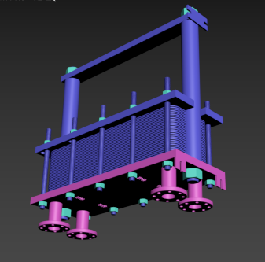
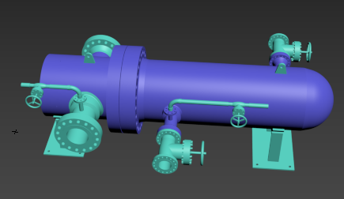
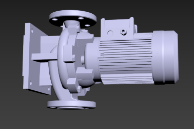
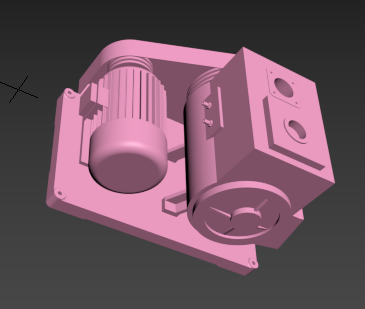
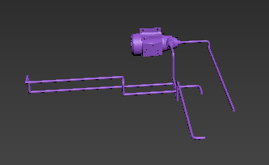
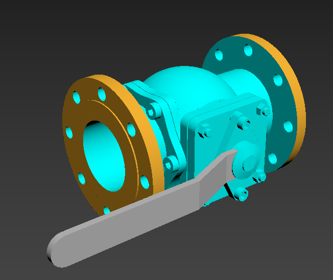
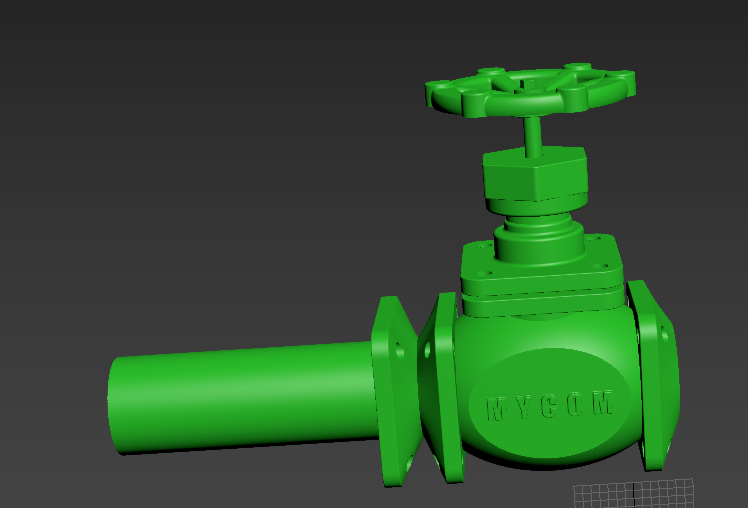
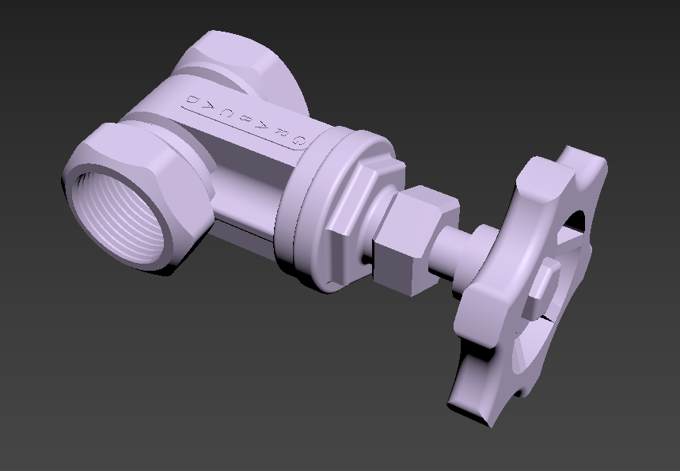

## 2024-06-22 会议记录

### 相关材料

#### 模型及参考网址

+ 换热器
    + 板式换热器
        + 
        + https://www.bilibili.com/video/BV1xJ4115712/?spm_id_from=333.788.recommend_more_video.0&vd_source=723e930be0bc55398e7b5a5271bb428f
        + https://www.bilibili.com/video/BV1Th4y1v7jH/?spm_id_from=333.788.recommend_more_video.-1&vd_source=723e930be0bc55398e7b5a5271bb428f
    + 卧式换热器
        + 
        + https://www.bilibili.com/video/BV1Z24y187tq/?spm_id_from=333.788.recommend_more_video.-1&vd_source=723e930be0bc55398e7b5a5271bb428f
        + https://www.bilibili.com/video/BV1HM411b7q1/?spm_id_from=333.788.recommend_more_video.0&vd_source=723e930be0bc55398e7b5a5271bb428f
+ 泵
    + 管道循环泵
        + 
        + https://www.bilibili.com/video/BV1ez4y147J7/?spm_id_from=333.337.search-card.all.click&vd_source=723e930be0bc55398e7b5a5271bb428f
        + https://www.bilibili.com/video/BV1kj411N74L/?spm_id_from=333.337.search-card.all.click&vd_source=723e930be0bc55398e7b5a5271bb428f
    + 旋片真空泵
        + 
        + https://www.bilibili.com/video/BV1hK4y1K7Sm/?spm_id_from=333.337.search-card.all.click&vd_source=723e930be0bc55398e7b5a5271bb428f
    + 0.5 HP Water Bump
        + 
        + https://www.bilibili.com/video/BV1F8411h7Jf/?spm_id_from=333.337.search-card.all.click&vd_source=723e930be0bc55398e7b5a5271bb428f
+ 阀门
    + 
    + https://www.bilibili.com/video/BV1hJ4m1T7Ut/?spm_id_from=333.788.recommend_more_video.0&vd_source=723e930be0bc55398e7b5a5271bb428f

#### 需求定义

设计一套面向核工程的换热冷却数字孪生原型系统

+ 模型交互运动
    + 直接操作：虚拟环境中选中物体、移动物体等基础操作支持，系统需要在移动后自适应调整
    + 脚本操控：采用json格式的序列化文件对系统的可视化运行进行控制
    + 定制化交互：在VR环境中运行本系统，可通过手柄与系统交互（可选：制作手物交互动画）
+ 动态模型调整
    + 主副系统：设计两个系统，可以通过简易的阀门控制进行切换
    + 参数面板：用户通过参数面板动态控制关键参数，模型实时更新

### 下周任务

#### 组一

+ 继续尝试模型转化方法
    + 需求：
        + 转换后的模型需要有层级划分（结构树）
        + 尽量恢复原始模型的结构、材质
+ ==给出初版可用模型==（glb）
    + 若模型为整体（不含细节部件的结构），则选用以下解决方案
        + 上网搜索相关精细度更高的同类模型，替换现有模型
        + 搜索细节部件的模型，并将其拼接在Godot平台，构建模型的层次结构

#### 组二

+ 根据组一提供的初版模型和组四提供的原理图，==在Godot引擎中搭建出初始场景==

#### 组三

+ 根据组一提供的初版模型和组四提供的原理图，==在Godot引擎中搭建出初始场景==
+ 调研主副系统设计

#### 组四

+ 调研相关系统、数字孪生的资料和论文（3系陶飞老师），==给出初版原理图==
+ ==调研系统中两个小管道的作用==

#### 其他

调查液体可视化效果（插件）

调查精细模型

梳理冷却系统结构和流程（泵，闸门，换热器管道等）节点参数化位置
